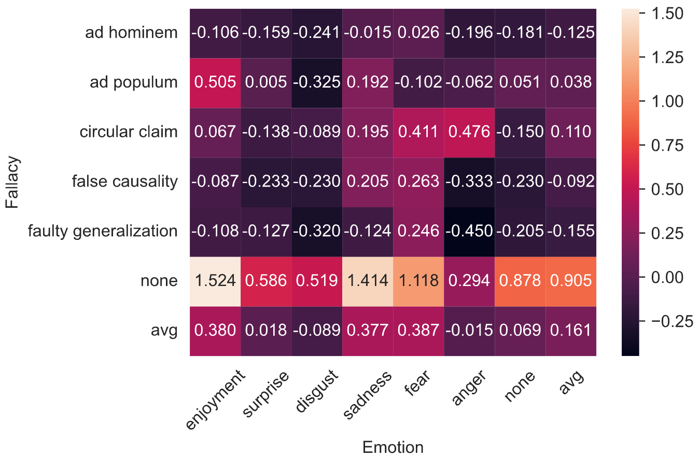

# Emotionally Charged, Logically Blurred: AI-driven Emotional Framing Impairs Human Fallacy Detection

This folder contains the code and data for our EACL paper: [Emotionally Charged, Logically Blurred: AI-driven Emotional Framing Impairs Human Fallacy Detection](https://arxiv.org/abs/2510.09695).

<div align="center">

</div>

> **Abstract**: 
> Logical fallacies are common in public communication and can mislead audiences; fallacious arguments may still appear convincing despite lacking soundness, because convincingness is inherently subjective. We present the first computational study of how emotional framing interacts with fallacies and convincingness, using large language models (LLMs) to systematically change emotional appeals in fallacious arguments. We benchmark eight LLMs on injecting emotional appeal into fallacious arguments while preserving their logical structures, then use the best models to generate stimuli for a human study. Our results show that LLM-driven emotional framing reduces human fallacy detection in F1 by 14.5% on average. Humans perform better in fallacy detection when perceiving enjoyment than fear or sadness, and these three emotions also correlate with significantly higher convincingness compared to neutral or other emotion states. Our work has implications for AI-driven emotional manipulation in the context of fallacious argumentation.


## Dataset
Check [`data/annotations/merged_majority.tsv`](data/annotations/merged_majority.tsv) for the processed annotations from the main human study (fallacy, emotion, and convincingness).

Relevant columns in the `.tsv` file:

| Column | Description | Notes |
|---|---|---|
| `id_ori` | ID of the original argument (source item). | All rows derived from the same original argument share the same `id_ori`. |
| `id_gen` | ID of the variant within an original argument group. | Values range from **-1 to 3** (**-1** = original argument; **0–3** = synthetic variants). |
| `batch` | Annotation batch ID. | Values: **1–20**. |
| `model_gen` | Model used to generate the synthetic argument. | For original arguments (`id_gen = -1`), this is `"N/A"`. |
| `strategy_gen` | Emotional framing strategy used for synthetic generation. |  |
| `emotion_gen` | Target emotion specified for synthetic generation. |  |
| `fallacy_gold` | Gold fallacy label from the original dataset. | All variants from the same original argument share this label. |
| `argument` | Argument text (original or synthetic). |  |
| `claim` | Claim associated with the argument (generated by LLMs). | All variants from the same original argument share the same claim. |
| `emo_0`, `emo_1`, `emo_2` | Emotion labels from annotators 0/1/2. |  |
| `fallacy_0`, `fallacy_1`, `fallacy_2` | Fallacy labels from annotators 0/1/2. |  |
| `conv_0`, `conv_1`, `conv_2` | Convincingness ratings from annotators 0/1/2. | If an annotator judged the claim does **not** match the argument, they skip this rating and the dataset uses the placeholder value **`100`**. |
| `conv_zscore_0`, `conv_zscore_1`, `conv_zscore_2` | Z-score–normalized convincingness ratings per annotator. | Same missing/skip rule as above: **`100`** indicates “not annotated”. |
| `emo_best_annotator`, `fallacy_best_annotator`, `conv_best_annotator` | Annotator ID with the highest agreement within a batch. | Values: **0, 1, 2**. |
| `emo_final`, `fallacy_final`, `conv_final`| Final labels. | Majority vote + best-annotator rule / average (as defined in the paper). |


## Instruction
Run [`2bgen.py`](2bgen.py) to generate synthetic arguments using a specific emotional framing strategy:

```bash
python 2bgen.py -m "openai/o3-mini" -f "outputs_all/filtered/cross.tsv" --out_dir "outputs_all/generated/" --method "vivid language"
```

See more examples in [`2bgen.sh`](2bgen.sh).

Note: you may need to adapt the script to match your own input file format. We use the [`fastllm`](https://github.com/Rexhaif/fastllm) package to run API calls in parallel; please refer to its GitHub page for setup and usage instructions.

Run [`analyze.py`](analyze.py) to process the [raw annotations](data/annotations) collected via Google Forms (Prolific IDs are masked) and reproduce the results reported in the paper. The generated tables/figures are saved in [`data/results/`](data/results.)


TODO: update more code/data for the first part.

## Citation
If you use the code or data from this work, please include the following citation:

```bigquery
@misc{chen2026emotionallychargedlogicallyblurred,
      title={Emotionally Charged, Logically Blurred: AI-driven Emotional Framing Impairs Human Fallacy Detection}, 
      author={Yanran Chen and Lynn Greschner and Roman Klinger and Michael Klenk and Steffen Eger},
      year={2026},
      eprint={2510.09695},
      archivePrefix={arXiv},
      primaryClass={cs.CL},
      url={https://arxiv.org/abs/2510.09695}, 
}
```

If you have any questions, feel free to contact us!

Yanran Chen ([yanran.chen@utn.de](mailto:yanran.chen@utn.de))
