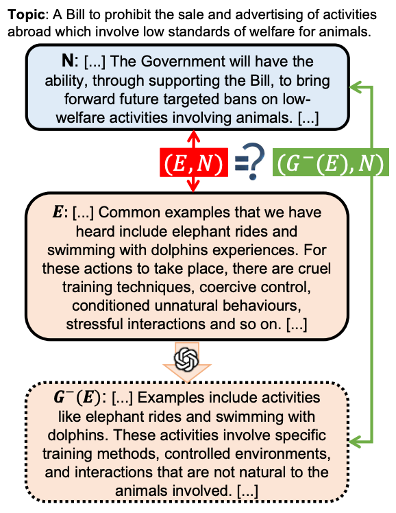
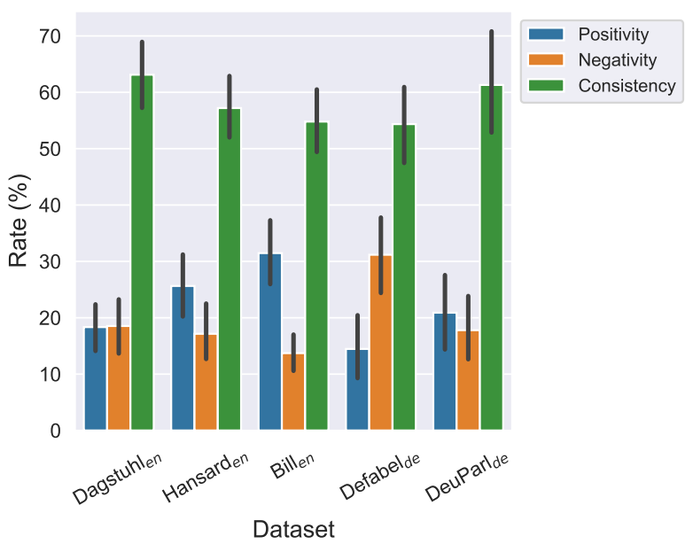

# Do Emotions Really Affect Argument Convincingness? A Dynamic Approach with LLM-based Manipulation Checks

This folder contains the code and data for our ACL paper: [Do Emotions Really Affect Argument Convincingness? A Dynamic Approach with LLM-based Manipulation Checks](https://aclanthology.org/2025.findings-acl.1250/). 


[](https://arxiv.org/abs/2503.00024)
[](https://huggingface.co/datasets/nllg/emo_conv)


<div align="center">


</div>

> **Abstract**: 
> Emotions have been shown to play a role in argument convincingness, yet this aspect is underexplored in the natural language processing (NLP) community. Unlike prior studies that use static analyses, focus on a single text domain or language, or treat emotion as just one of many factors, we introduce a dynamic framework inspired by manipulation checks commonly used in psychology and social science; leveraging LLM-based manipulation checks, this framework examines the extent to which perceived emotional intensity influences perceived convincingness. Through human evaluation of arguments across different languages, text domains, and topics, we find that in over half of cases, human judgments of convincingness remain unchanged despite variations in perceived emotional intensity; when emotions do have an impact, they more often enhance rather than weaken convincingness.We further analyze whether 11 LLMs behave like humans in the same scenario, finding that while LLMs generally mirror human patterns,they struggle to capture nuanced emotional effects in individual judgments.

## 💽 Dataset
[`data_cleaned/merged_masked.csv`](data_cleaned/merged_masked.csv) contains (only) the pairwise comparison annotations for convincingness and emotion. You can find the corresponding arguments for each annotation instance in [`data_cleaned/arguments/`](data_cleaned/arguments/) using the instance ID. We will release a merged dataset with all arguments and annotations on Hugging Face soon.


[`data_cleaned/cleaned_all/llms/`](data_cleaned/cleaned_all/llms/) contains LLM outputs. 

## ⏯ Code

TODO

## 👀 Citation
If you use the code or data from this work, please include the following citation:

```bigquery
@inproceedings{chen-eger-2025-emotions,
    title = "Do Emotions Really Affect Argument Convincingness? A Dynamic Approach with {LLM}-based Manipulation Checks",
    author = "Chen, Yanran  and
      Eger, Steffen",
    editor = "Che, Wanxiang  and
      Nabende, Joyce  and
      Shutova, Ekaterina  and
      Pilehvar, Mohammad Taher",
    booktitle = "Findings of the Association for Computational Linguistics: ACL 2025",
    month = jul,
    year = "2025",
    address = "Vienna, Austria",
    publisher = "Association for Computational Linguistics",
    url = "https://aclanthology.org/2025.findings-acl.1250/",
    doi = "10.18653/v1/2025.findings-acl.1250",
    pages = "24357--24381",
    ISBN = "979-8-89176-256-5"
}
```

If you have any questions, feel free to contact us!

Yanran Chen ([yanran.chen@utn.de](mailto:yanran.chen@utn.de))
